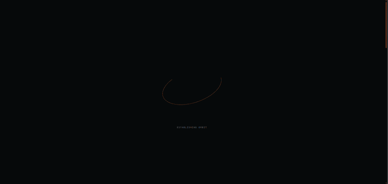

# VayuDrishti — Satellite-Derived Surface AQI & HCHO Hotspot Detection over India

**Development of Satellite-Derived Surface AQI and Identification of HCHO Hotspots over India
using INSAT-3D / MAIAC, Sentinel-5P (TROPOMI), CPCB / OpenAQ and ERA5 Reanalysis Data.**

A satellite remote-sensing + machine-learning system that (1) estimates ground-level pollutant
concentrations and maps a daily Air Quality Index (AQI) over India, and (2) detects, attributes
and traces formaldehyde (HCHO) hotspots driven by VOC emissions and biomass burning.
Bharatiya Antariksh Hackathon 2026 · Challenge 03.

**This is now a single unified repository** — the Python research pipeline (`src/`, `pipelines/`)
and the Next.js web app (`app/`, `components/`, `lib/`, `public/`) live together here. The web app
builds from the repo root.

> **Full code walkthrough:** see [`docs/ARCHITECTURE.md`](docs/ARCHITECTURE.md) (rendered:
> [`docs/VAYU_Architecture.pdf`](docs/VAYU_Architecture.pdf)) for a complete, file-by-file
> analysis of the model, backend logic, and frontend.


*Interactive web dashboard visualizing satellite-derived surface AQI, HCHO hotspot detection, biomass burning dynamics, and atmospheric back-trajectories.*

---

## Built on VAYU

VayuDrishti is not a from-scratch system. It is an adapted and extended version of the original
**VAYU** research pipeline and visualization architecture by **[aksh08022006](https://github.com/aksh08022006)**:
[github.com/aksh08022006/vayu-aqi-hcho](https://github.com/aksh08022006/vayu-aqi-hcho).

The Random Forest / regression-kriging pollutant models, the deterministic CPCB AQI engine, the
RAPI index, PHV and Getis–Ord Gi* HCHO detection, source attribution, back-trajectory analysis,
and the Next.js + MapLibre + deck.gl frontend architecture all originate from VAYU and remain the
foundation of this project. Full credit to the original author for that groundwork —
see [`docs/ARCHITECTURE.md`](docs/ARCHITECTURE.md) for VAYU's original design.

**What VayuDrishti adds on top of that foundation:**

- **K-Means pollution zoning** (`src/isro_aqi/models/zones.py`) — auditable, silhouette-selected
  cluster count, relative severity zones (Good / Moderate / Poor), explicitly labeled as
  exploratory rather than official CPCB categories.
- **Isolation Forest hotspot comparison** (`src/isro_aqi/hcho/isolation_forest.py`) — a
  multivariate anomaly baseline compared against PHV/Gi* via overlap and Jaccard metrics, not a
  replacement for either.
- **A shared analysis-layer output contract** (`src/isro_aqi/analysis_layers.py`) with metadata
  describing method, selected K, contamination, and whether output is synthetic or real.
- **New frontend modes** for K-Means zones, Isolation Forest anomalies, and a PHV-vs-Isolation
  Forest comparison view, plus explicit method disclaimers in the UI.
- Project identity, documentation, package metadata, and a pnpm-standardized frontend build.

In short: **official AQI and PHV/Gi* hotspot evidence remain primary and unchanged from VAYU**;
K-Means and Isolation Forest are additional, clearly-labeled comparative views layered on top.
This is described honestly as an extended derivative, not a claim of an independently invented
AQI model.

---

## Research questions

| # | Objective | Question |
|---|-----------|----------|
| 1 | Surface AQI | Can satellite observations predict ground-level pollution and generate daily AQI maps across India? |
| 2 | HCHO hotspots | Can TROPOMI HCHO identify VOC emission hotspots and biomass-burning episodes across India? |
| 3 | Source attribution | How much do crop-residue burning, forest fires and long-range transport contribute to HCHO enhancement? |

---

## How it actually works

```
 INSAT/MAIAC AOD ─┐  gap-fill (RF)      ┌─ trend μ : Random Forest (per pollutant)
 TROPOMI gases ───┤  NO2 calibration    │            +
 ERA5 met ────────┼──▶ gridded backbone ┤  resid v : kriged station residuals
 CPCB / OpenAQ ───┤  + engineered feats └─▶ C(s,t)=μ+v ─▶ AQI engine ─▶ daily maps
 Land cover / DEM ┤                              │
 Fire counts ─────┘                       CPCB AQI (max-rule) + RAPI (entropy) + divergence

 TROPOMI HCHO ──┐
 VIIRS/MODIS ───┤
 ERA5 winds ────┼─▶ PHV + Getis-Ord Gi* ─▶ connected clusters ─▶ source attribution ─▶ transport
 Land cover ────┘
```

**The model, precisely.** Surface concentrations are predicted by a **Random Forest** — used
either bare (per pollutant) in the real-data run, or as the *trend term* `μ` of a
**regression-kriging hybrid** `C(s,t) = μ + v`, where `v` is a Gaussian-kernel kriging of the
per-station residuals that fades to zero away from monitors. A **CNN-LSTM** (spatial CNN per day →
LSTM over a 7-day window) is also implemented and validated as the "recommended" learner, but it
is **not** on the map-generation path yet. The concentration grids are turned into AQI by a
deterministic CPCB engine (piecewise-linear sub-indices → max rule), which also computes the
project's entropy-weighted **RAPI** index and a **RAPI − CPCB divergence** map.

See [`docs/ARCHITECTURE.md`](docs/ARCHITECTURE.md) §2–§4 for the model internals and §12 for an
honest list of what is real vs. showcased.

---

## Real validation (`outputs/real_validation.json`)

Random Forest trained on real OpenAQ/CPCB ground truth vs. GEE satellite predictors,
~158 stations · ~4,300 station-days · Oct–Dec 2025. Reported under **dual cross-validation**:

| Pollutant | Random-CV R² (interpolation) | Spatial-CV R² (unseen regions) |
|---|---|---|
| PM2.5 | 0.53 | 0.03 |
| PM10  | 0.58 | 0.02 |
| NO₂   | 0.71 | −0.15 |
| O₃    | 0.66 | — |
| SO₂   | 0.46 | −0.96 |
| CO    | 0.69 | 0.19 |

The gap between random and spatial CV is deliberate and honest: **random CV** measures skill at
*known* stations (held-out days), while **spatial CV** measures *extrapolation* to **unmonitored
regions** (held-out 2°×2° blocks) — exposing spatial-autocorrelation leakage (Wang 2023).

---

## Quick start

### Run the website (frontend)

```bash
pnpm install
pnpm dev               # http://localhost:3000  (reads public/data/*.json)
```

### Frontend package manager

The web application uses **pnpm**. Do not use npm commands in this project; use `pnpm install`, `pnpm dev`, `pnpm build`, and `pnpm start`.

### Run the research pipeline (Python)

```bash
# 0. Install (the editable package + its runtime deps)
pip install -e . && pip install -r requirements.txt
#   or:  conda env create -f environment.yml && conda activate isro-aqi && pip install -e .

# 1. TRY IT NOW — full pipeline end-to-end on synthetic India data, NO credentials:
make demo                        # -> outputs/ : AQI maps, HCHO hotspots, figures, demo_summary.md
#   (quick smoke version: make demo-fast)

# --- then, for REAL data ---
make check-ingest                # readiness doctor: checks packages, GEE/CDS/FIRMS creds, config
earthengine authenticate         # one-time Google Earth Engine auth

OPENAQ_API_KEY=... make real      # real CPCB/OpenAQ-validated AQI + dual CV -> public/data/aqi_frames.json
make fetch-web                    # real TROPOMI/MODIS/ERA5 layers -> public/data/*.json
```

### Make targets

| Target | Runs | Purpose |
|---|---|---|
| `make demo` | `run_demo.py` | Full synthetic end-to-end (no credentials) |
| `make real` | `run_real.py` | Real OpenAQ/CPCB-validated AQI + dual CV |
| `make fetch-web` | `fetch_real_web.py` | Real satellite observation layers → web |
| `make check-ingest` | `check_ingest.py` | Pre-flight readiness check |
| `make ingest / preprocess / database / train` | `01–04_*.py` | The numbered phase pipeline (steps 05–07 are scaffold stubs) |
| `make test` / `make lint` | pytest / ruff | Deterministic cores (AQI, PHV, Gi*) are unit-tested |

> The numbered `pipelines/05_07_*.py` are intentionally **stubs** — the real AQI / HCHO /
> transport computation runs inside `run_demo.py`, `run_real.py` and `fetch_real_web.py`.

---

## Repository layout

```
# ── Web app (Next.js 16, deploys from repo root) ──
app/             routes: / problem method aqi hcho model impact
components/       DeckMap (deck.gl + MapLibre), sections, IndiaField, Pipeline, …
lib/              chapters, india geo utils, reveal hooks
public/data/      the 7 JSON/GeoJSON layers the frontend reads
package.json  pnpm-lock.yaml  next.config.ts  tsconfig.json  postcss.config.mjs

# ── Python research pipeline ──
config/          YAML config (AOI, dates, dataset asset IDs, AQI breakpoints, regions)
docs/            ARCHITECTURE.md (+ PDF), WEB_OVERVIEW.md, per-phase research blueprint
src/isro_aqi/    Python package
  ingestion/     GEE (Sentinel-5P, ERA5, MODIS/VIIRS, WorldCover, SRTM) + CPCB/OpenAQ + INSAT
  preprocessing/ regrid, QA filter, AOD gap-fill, NO2 calibration, collocation, temporal
  database/      unified (date,lat,lon) schema + parquet builder
  features/      engineered predictors (FNR, cyclical DOY, interactions)
  models/        RF, XGBoost, CNN, CNN-LSTM, regression-kriging hybrid + training loop
  aqi/           CPCB AQI sub-index + RAPI entropy engine
  hcho/          PHV, Getis-Ord Gi*, source attribution, transport
  viz/           maps & publication figures
  synthetic.py   physically-plausible synthetic India (powers `make demo`)
pipelines/       CLI entry points (run_demo, run_real, fetch_real_web, export_web, 01–07, Makefile)
tests/           unit tests (AQI engine, PHV, Gi* are deterministic → fully tested)
outputs/         maps / figures / real_validation.json / demo_summary
```

---

## Compute model

- **Server-side (Google Earth Engine):** Sentinel-5P (NO₂/SO₂/CO/O₃/HCHO), ERA5(-Land),
  MAIAC AOD, MODIS/VIIRS fire, ESA WorldCover, SRTM — filtered, reduced and exported as
  analysis-ready rasters/tables, keeping India-scale data off the local disk.
- **Local:** CPCB/OpenAQ station data, database assembly, model training, AQI computation,
  HCHO analysis, figures, and JSON export for the web layer.

## The web layer

A Next.js 16 / React 19 scrollytelling site (VayuDrishti) using **deck.gl + MapLibre** (no Mapbox token),
**Anime.js** and **Lenis**. The map (`components/DeckMap.tsx`) rasterizes the gridded JSON into
smooth atmospheric fields via a GPU `BitmapLayer`. It reads seven static files from `public/data/`
produced by the pipelines: `aqi_frames.json`, `gas_grids.json`, `hcho_grid.json`, `hotspots.json`,
`fires.json`, `trajectory.json`, and `india.geojson`. A product-focused overview lives in
[`docs/WEB_OVERVIEW.md`](docs/WEB_OVERVIEW.md).

---

## Phase docs

The original 14-phase scientific blueprint (methodology, math, rationale) lives in
[`docs/`](docs/) — `01_literature_review.md` … `14_explainability.md`, plus
[`docs/IMPLEMENTATION_REPORT.md`](docs/IMPLEMENTATION_REPORT.md). These describe the intended
design; [`docs/ARCHITECTURE.md`](docs/ARCHITECTURE.md) describes what is **actually implemented**.

## Acknowledgments

- **[VAYU](https://github.com/aksh08022006/vayu-aqi-hcho)** by [aksh08022006](https://github.com/aksh08022006)
  — the base repository this project is built on. The core AQI/HCHO pipeline, CPCB AQI engine,
  PHV/Gi* detection, and the deck.gl/MapLibre frontend architecture originate there.

## License

This project is licensed under the [MIT License](LICENSE).